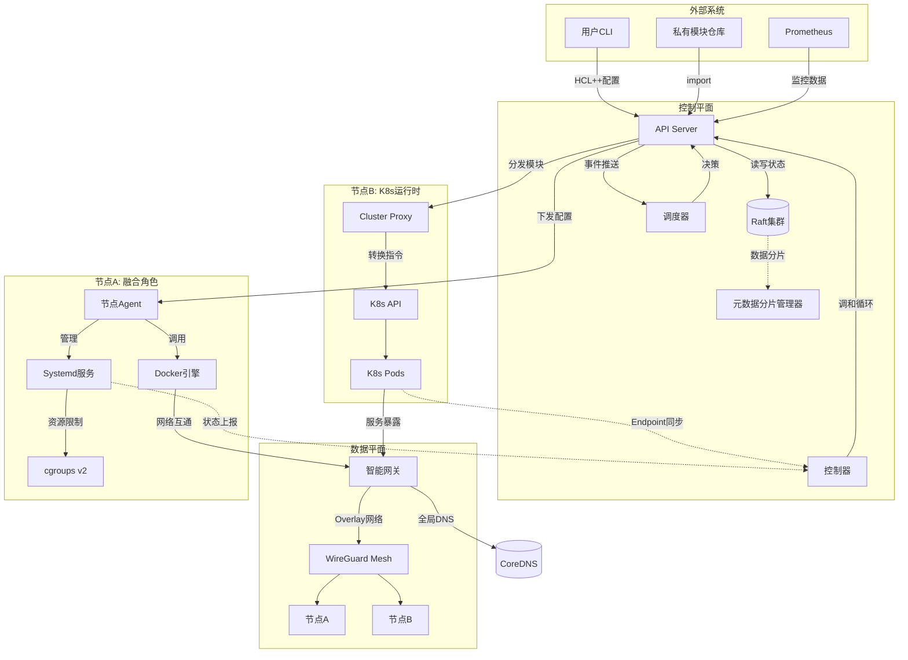

# Warden System

## what is warden
 
A workload system

## Architecture

```mermaid
%% 多运行时服务编排系统架构图
graph TD
  %% ================== 控制平面 ==================
  subgraph ControlPlane[控制平面]
    CP1[API Server] -->|读写状态| CP2[(Raft集群)]
    CP1 -->|事件推送| CP3[调度器]
    CP3 -->|决策| CP1
    CP4[控制器] -->|调和循环| CP1
    CP2 -.->|数据分片| CP5[元数据分片管理器]
  end

  %% ================== 数据平面 ==================
  subgraph DataPlane[数据平面]
    DP1[智能网关] -->|Overlay网络| DP2[WireGuard Mesh]
    DP2 --> DP3[节点A]
    DP2 --> DP4[节点B]
  end

  %% ================== 多运行时节点 ==================
  subgraph NodeA[节点A: 融合角色]
    A1[节点Agent] -->|管理| A2[Systemd服务]
    A1 -->|调用| A3[Docker引擎]
    A2 -->|资源限制| A4[cgroups v2]
    A3 -->|网络互通| DP1
  end

  subgraph NodeB[节点B: K8s运行时]
    B1[Cluster Proxy] -->|转换指令| B2[K8s API]
    B2 --> B3[K8s Pods]
    B3 -->|服务暴露| DP1
  end

  %% ================== 外部集成 ==================
  subgraph External[外部系统]
    E1[用户CLI] -->|HCL++配置| CP1
    E2[私有模块仓库] -->|import| CP1
    E3[Prometheus] -->|监控数据| CP1
  end

  %% ================== 关键交互 ==================
  CP1 -->|下发配置| A1
  CP1 -->|分发模块| B1
  A2 -.->|状态上报| CP4
  B3 -.->|Endpoint同步| CP4
  DP1 -->|全局DNS| DN1[(CoreDNS)]
```